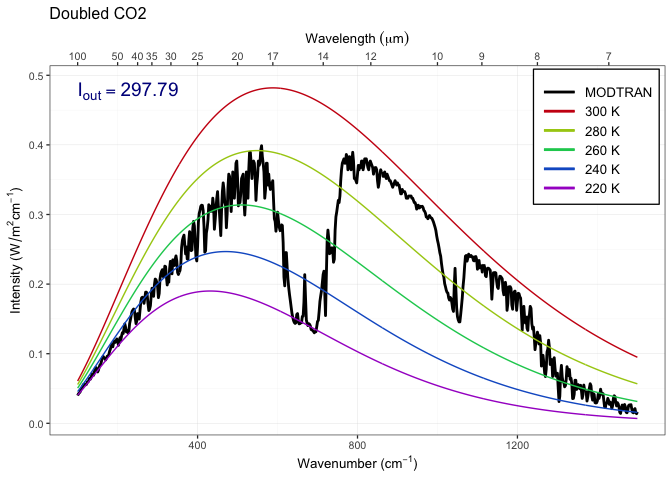

EES 3310/5310 Lab \#3
================
Lauryn Gayles
Lab: Wed. Jan. 24. Due: Wed. Jan. 31

- [Exercise 4.1: Methane](#exercise-41-methane)
- [Exercise 4.3: Water vapor](#exercise-43-water-vapor)

Fill in R code for the exercises (I have put the comment `# TODO` in all
of the code chunks where you need to do this) and then fill in the
answers where I have marked **Answer:**. Be sure to write explanations
of your answer and don’t just put numbers with no text.

## Exercise 4.1: Methane

Methane has a current concentration of 1.7 ppm in the atmosphere and is
doubling at a faster rate than CO<sub>2</sub>.

1)  **Would an additional 10 ppm of methane in the atmosphere have a
    larger or smaller impact on the outgoing IR flux than an additional
    10 ppm of CO<sub>2</sub> at current concentrations?**

    **Hint:** See the suggestion in the `lab-03-instructions` document.

``` r
modtran_400_17.txt = run_modtran("my_modtran_file.txt", co2_ppm = 400, ch4_ppm = 1.7) #run with different values
modtran_410_17.txt = run_modtran("my_modtran_file.txt", co2_ppm = 410, ch4_ppm = 1.7) #run with different values
modtran_400_117.txt = run_modtran("my_modtran_file.txt", co2_ppm = 400, ch4_ppm = 11.7) #run with different values


modtran_400_17 <- modtran_400_17.txt$i_out #isolate the IR flux 
print(modtran_400_17) #print 
```

    ## [1] 298.6712

``` r
modtran_410_17 <- modtran_410_17.txt$i_out #isolate the IR flux 
print(modtran_410_17) #print 
```

    ## [1] 298.5455

``` r
modtran_400_117 <- modtran_400_117.txt$i_out #isolate the IR flux 
print(modtran_400_117) #print 
```

    ## [1] 295.561

**Answer:** *Put your answer here.* Be sure to explain your reasoning
and show data, plots, etc. to explain how you came up with your answer.

The additional 10 ppm of methane has a larger impact than an additional
10 ppm of CO2. We can see the decrease in the IR flux was much greater
with the additional methane than the additional CO2.

2)  **Where in the spectrum does methane absorb? What concentration does
    it take to begin to saturate the absorption in this band? Explain
    what you are looking at to judge when the gas is saturated.**

    **Hints:**  
    See the hints in the `lab-03-instructions` document.

``` r
ch4_list = c(0,1, 2, 4, 8, 16, 32, 64, 128) #creating a list to go through the different numbers

for (ch4 in ch4_list) {
mod_data = run_modtran(co2_ppm = 0, ch4_ppm = ch4, trop_o3_ppb = 0, strat_o3_scale = 0, h2o_scale = 0, freon_scale = 0)
p = plot_modtran(mod_data, descr = str_c(ch4, 'ppm ch4')) #setting the the variables to 0 
plot(p) # you could also say print(p) here.
}
```

    ## Warning: Using `size` aesthetic for lines was deprecated in ggplot2 3.4.0.
    ## ℹ Please use `linewidth` instead.
    ## This warning is displayed once every 8 hours.
    ## Call `lifecycle::last_lifecycle_warnings()` to see where this warning was
    ## generated.

    ## Warning: The `size` argument of `element_line()` is deprecated as of ggplot2 3.4.0.
    ## ℹ Please use the `linewidth` argument instead.
    ## This warning is displayed once every 8 hours.
    ## Call `lifecycle::last_lifecycle_warnings()` to see where this warning was
    ## generated.

<!-- --><!-- --><!-- --><!-- --><!-- --><!-- --><!-- --><!-- --><!-- -->

**Answer:**

1300 cm-1 is the wavelength where methane absorbs. The ppm for methane
seems to be around 16 ppm.

3)  **Would a doubling of methane have as great an impact on the heat
    balance as a doubling of CO<sub>2</sub>?**

    **Hint:** See the suggestion in the `lab-03-instructions` document.

``` r
m = run_modtran("my_modtran_file.txt")
m1 = run_modtran("my_modtran_file.txt", ch4_ppm = 3.4)
m2 = run_modtran("my_modtran_file.txt", co2_ppm = 800, ch4_ppm = 1.7)


modtran <- m$i_out #isolate the IR flux 
print(modtran_400_17) #print 
```

    ## [1] 298.6712

``` r
modtran_1 <- m1$i_out #isolate the IR flux 
print(modtran_410_17) #print 
```

    ## [1] 298.5455

``` r
modtran_2 <- m2$i_out #isolate the IR flux 
print(modtran_400_117) #print 
```

    ## [1] 295.561

``` r
plot_modtran(m, descr = "Baseline spectrum")
```

<!-- -->

``` r
plot_modtran(m1, descr = "Doubled CO2")
```

<!-- -->

``` r
plot_modtran(m2, descr = "Doubled CH4")
```

<!-- -->

**Answer:**

Doubling CO2, wavelength decreases by -3.3 W/m2. Doubling CH4,
wavelength decreases by -0.88 W/m2. The increase in CO2 has a larger
effect because there is more CO2 present in the atmosphere.

4)  **What is the “equivalent CO<sub>2</sub>” of doubling atmospheric
    methane? That is to say, how many ppm of CO<sub>2</sub> would lead
    to the same change in outgoing IR radiation energy flux as doubling
    methane? What is the ratio of ppm CO<sub>2</sub> change to ppm
    methane change?**

``` r
matching_methane = 13 # the ppm after trial and error 
modtran_match_ch4 = run_modtran(file.path(data_dir, "ex_4_1_ch4_match.txt"),
                                co2_ppm = 400, ch4_ppm = matching_methane)

print(modtran_match_ch4) #priting data to see teh results 
```

    ## $spectrum
    ## # A tibble: 1,100 × 12
    ##        k lambda        pk       pl       sk       sl   srk   srl      tk      tl
    ##    <dbl>  <dbl>     <dbl>    <dbl>    <dbl>    <dbl> <dbl> <dbl>   <dbl>   <dbl>
    ##  1     2  5000.  9.70e-10 3.88e-13 2.20e-10 8.81e-14     0     0 3.74e-5 1.49e-8
    ##  2     4  2500   3.47e- 9 5.56e-12 4.92e-10 7.87e-13     0     0 1.25e-4 1.99e-7
    ##  3     6  1667.  8.13e- 9 2.93e-11 3.55e-10 1.28e-12     0     0 2.66e-4 9.58e-7
    ##  4     8  1250   1.45e- 8 9.31e-11 2.07e-10 1.32e-12     0     0 4.62e-4 2.96e-6
    ##  5    10  1000   2.22e- 8 2.22e-10 6.68e-11 6.68e-13     0     0 6.97e-4 6.97e-6
    ##  6    12   833.  3.05e- 8 4.39e-10 8.25e-13 1.19e-14     0     0 9.58e-4 1.38e-5
    ##  7    14   714.  4   e- 8 7.83e-10 1.10e-16 2.17e-18     0     0 1.26e-3 2.46e-5
    ##  8    16   625   5.08e- 8 1.3 e- 9 6.33e-21 1.62e-22     0     0 1.60e-3 4.08e-5
    ##  9    18   556.  6.13e- 8 1.98e- 9 2.23e-19 7.23e-21     0     0 1.92e-3 6.22e-5
    ## 10    20   500   7.64e- 8 3.05e- 9 2.23e-19 8.92e-21     0     0 2.40e-3 9.58e-5
    ## # ℹ 1,090 more rows
    ## # ℹ 2 more variables: int <dbl>, trans <dbl>
    ## 
    ## $co2
    ## co2mx 
    ##   400 
    ## 
    ## $ch4
    ## ch4rat 
    ##     13 
    ## 
    ## $i_out
    ## [1] 295.3411
    ## 
    ## $alt
    ## [1] 70
    ## 
    ## $sensor_direction
    ## [1] down
    ## Levels: up down
    ## 
    ## $profile
    ## # A tibble: 33 × 7
    ##        Z     P     T    H2O     O3   CO2   CH4
    ##    <dbl> <dbl> <dbl>  <dbl>  <dbl> <dbl> <dbl>
    ##  1     0  1013  300. 18756. 0.0287   400  13  
    ##  2     1   904  294. 14381. 0.0315   400  13  
    ##  3     2   805  288. 11540. 0.0334   400  13  
    ##  4     3   715  284.  6559. 0.035    400  13  
    ##  5     4   633  277   3476. 0.0356   400  13  
    ##  6     5   559  270.  2683. 0.0377   400  13  
    ##  7     6   492  264.  1726. 0.0399   400  13  
    ##  8     7   432  257   1086. 0.0422   400  13  
    ##  9     8   378  250.   661. 0.0447   400  13  
    ## 10     9   329  244.   365. 0.05     400  12.9
    ## # ℹ 23 more rows
    ## 
    ## $h_tropo
    ## [1] 17
    ## 
    ## $t_tropo
    ## [1] 194.8
    ## 
    ## $t_ground
    ## [1] 299.7
    ## 
    ## $atmosphere
    ## [1] "TROPICAL MODEL"

**Answer:** \_

The answer is 13 ppm which is achieved thorugh trial and error. the iout
is 295.3411.

## Exercise 4.3: Water vapor

Our theory of climate presumes that an increase in the temperature at
ground level will lead to an increase in the outgoing IR energy flux at
the top of the atmosphere.

1)  **How much extra outgoing IR would you get by raising the
    temperature of the ground by 5°C? What effect does the ground
    temperature have on the shape of the outgoing IR spectrum and why?**

    **Hint:** See the hint in the `lab-03-instructions` document.

``` r
modtran_baseline = run_modtran() #run the baseline modtran 
modtran_plus_5 = run_modtran(delta_t = 5) #change the temperature variable 

p_baseline = plot_modtran(modtran_baseline, descr = "Baseline spectrum") #plot
p_5_deg = plot_modtran(modtran_plus_5, #plot 
                        descr = "Ground temperature raised 5K")
plot(p_baseline) #print the plot 
```

<!-- -->

**Answer:**

We can see in the grpah that an increase in the ground temperature
causes a raise in the spectrum as a whole.

2)  **More water can evaporate into warm air than into cool air. Change
    the model settings to hold the water vapor at constant relative
    humidity rather than constant vapor pressure (the default),
    calculate the change in outgoing IR energy flux for a 5°C
    temperature increase. Is it higher or lower? Does water vapor make
    the Earth more sensitive to CO<sub>2</sub> increases or less
    sensitive?**

    **Note:** By default, the MODTRAM model holds water vapor pressure
    constant, but you can set it to hold relative humidity constant
    instead with the option `h2o_fixed = "relative humidity"`, like
    this:
    `run_modtran(file_name, delta_t = 5, h2o_fixed = "relative humidity")`.

``` r
modtran_vp = run_modtran(delta_t = 5, h2o_fixed = "vapor pressure") #run modtran with temp change being 5 
modtran_rh = run_modtran(delta_t = 5, h2o_fixed = "relative humidity") #run modtran with temp change being 5 

i_base = modtran_baseline$i_out #getting the i out data 
i_water_vapor = modtran_vp$i_out
i_humidity = modtran_rh$i_out

p_water_vapor = plot_modtran(modtran_vp, descr = "Constant vapor pressure", 
                    i_out_ref = i_base)
p_humidity = plot_modtran(modtran_rh, descr = "Constant relative humidity", 
                    i_out_ref = i_base)
plot(p_water_vapor)
```

<!-- -->

``` r
plot(p_humidity) #plotting the data 
```

<!-- -->

**Answer:**

The increase in temp has an increase effect on iout when the fixed
variable is water vapor. The environment is more sensitive to co2
changing when the humidity remain the same.

3)  **Now see this effect in another way.**

    - **Starting from the default base case, record the total outgoing
      IR flux.**

    - **Now double CO<sub>2</sub>. The temperature in the model stays
      the same (that’s how the model is written), but the outgoing IR
      flux goes down.**

    - **Using constant water vapor pressure, adjust the temperature
      offset until you get the original IR flux back again. Record the
      change in temperature.**

    - **Now repeat the exercise, but holding the relative humidity fixed
      instead of the water vapor pressure.**

    - **The ratio of the warming when you hold relative humidity fixed
      to the warming when you hold water vapor pressure fixed is the
      feedback factor for water vapor. What is it?**

``` r
i_base = modtran_baseline$i_out

modtran_800co2 = run_modtran(co2_ppm = 800) #run modtran with co2 at 800 ppm 
i_vapor_double = modtran_800co2$i_out #get the iout value 

dt_vp = 0.76
modtran_vp_dt = run_modtran(file.path(data_dir, "ex_4_3_vp_dt.txt"),
                            co2_ppm = 800, delta_t = dt_vp) #run modtran with co2 at 800 ppm
i_vp_dt = modtran_vp_dt$i_out #get the iout value

modtran_2x_rh = run_modtran(file.path(data_dir, "ex_4_3_2x_co2_rh_.txt"),#run modtran with co2 at 800 ppm
                            co2_ppm = 800, h2o_fixed = "relative humidity")
i_2x_rh = modtran_2x_rh$i_out

dt_rh = 1.21
modtran_rh_dt = run_modtran(file.path(data_dir, "ex_4_3_rh_dt.txt"),
                            co2_ppm = 800, delta_t = dt_rh, 
                            h2o_fixed = "relative humidity")
i_rh_dt = modtran_rh_dt$i_out

feedback = dt_rh / dt_vp

print(feedback) # print to see all values 
```

    ## [1] 1.592105

**Answer:** *Put your answer here.*

The answer is 1.592 for the feedback factor. This shows the the ratio of
the temp change with relative humidity fixed to that of the temp change
with water vapor fixed.
